# VRM-Rust

A hierarchical Virtual Resource Manager (VRM) implementation in Rust, designed to provide an abstraction layer for virtual resources and Service Level Agreements (SLAs) in High-Performance Computing (HPC) environments.

## Setup and Usage

### Pre-Requirements
Before you begin, ensure you have the following installed:
* Rust (latest stable version)
* Docker & Docker Compose (required for the virtual Slurm HPC environment)

### Installation
Clone the VRM-Rust repository and navigate into the project directory:
```bash
# Clone the VRM-Rust Repository
git clone git@github.com:Vincent-Fuecks/VRM-Rust.git
```
### Usage Modes 
#### Option A: RmsNodeSimulator (Quick Start)
To test VRM-Rust against a Slurm-based system, you must first set up the virtual cluster.
```bash
cargo run -- --input-file src/data/workflow_with_direct_mapping.json --config-file src/data/vrm_node_simulator.json
```


##### Step 1 Clone and Initialize Environment
```bash
# Clone the Virtual Slurm Environment (modified clone form https://github.com/giovtorres/slurm-docker-cluster)
git clone git@github.com:Vincent-Fuecks/virtual-slurm-environment.git
cd virtual-slurm-environment

# Generate a JWT key for authentication
openssl rand -out jwt_hs256.key 32

# Start the cluster to initialize directories
docker compose up -d
```

##### Step 2 Configure Authentication
Inject the JWT key into the docker cluster and set the correct permissions:
```bash
# Copy key to the control daemon
docker cp jwt_hs256.key slurmctld:/etc/slurm/jwt_hs256.key

# Set ownership
docker exec -u root slurmctld chown 991:991 /etc/slurm/jwt_hs256.key

# Restart the cluster to apply changes
docker compose down

# Update all compute nodes
./update_slurmfiles.sh slurm.conf
docker compose up -d
```

##### Step 3 Configure Authentication
Generate a REST API token for the user **vrmUser**. We’ll set a lifespan of one day for the token:
```bash
docker compose exec slurmctld scontrol token username=vrmUser lifespan=86400
```
[!IMPORTANT]
Copy the token output from the command above. You will need it for the final configuration.

##### Step 4: Verify Connection
Test the Slurm REST API connection using curl:
```bash
curl -s -v \
  -H "X-SLURM-USER-NAME: vrmUser" \
  -H "X-SLURM-USER-TOKEN: <YOUR-ACCESS-TOKEN>" \
  "http://localhost:6820/slurm/v0.0.41/ping"

# Should look like this: 
# *   Trying 127.0.0.1:6820...
# * Connected to localhost (127.0.0.1) port 6820 (#0)
# > GET /slurm/v0.0.41/ping HTTP/1.1
# > Host: localhost:6820
# > User-Agent: curl/7.81.0
# > Accept: */*
# > X-SLURM-USER-NAME: vrmUser
# > X-SLURM-USER-TOKEN: <<YOUR-ACCESS-TOKEN>>
# > 
# * Mark bundle as not supporting multiuse
# < HTTP/1.1 200 OK
# < Content-Length: 698
# < Content-Type: application/json
# < 
# {
#   "pings": [
#     {
#       "hostname": "slurmctld",
#       "pinged": "UP",
#       "latency": 1425,
#       "mode": "primary"
#     }
#   ],
#  ...
# }
```

##### Step 5 Configure VRM-Rust
Finally, update the project configuration to point to your new cluster. Open VRM-Rust/src/data/vrm_with_slurm.json and update the following fields:
```json
{
  "userName": "vrmUser",
  "jwtToken": "<YOUR-ACCESS-TOKEN>"
}
```
##### Step 6 Run the VRM-Rust with Demo data 
```bash
cargo run -- --input-file src/data/workflow_with_direct_mapping.json --config-file src/data/vrm_with_slurm.json
```

## Project Structure
├── src/
│   ├── api/                             # Contains the Transferable Objects  
│   ├── data/                            # Contains examples input for the VRM-Rust system 
│   │   ├── benchmark/                   # Benchmark data for the VRM-Rust vs. Java legacy system benchmark 
│   │   ├── demo/                        # Demo data to run the VRM-Rust system 
│   │   ├── generated_workflows/         # Directory, where generated workflows are stored
│   │   └── test/                        # Utilized VRM-Rust configuration and workflow for tests 
│   ├──domain  
│   │   ├── simulator/                   # Manges the system time of the VRM-Rust system (GlobalClock) 
│   │   ├── 
│   │   ├── 
│   │   └── 
|   └──  loader/                         # Parser to load JSON files
├── tests/              # Integration tests with sample avatars
└── Cargo.toml          # Build configuration

## Overview

This section details the VRM-Rust system architecture through the life cycle of a client reservation request for an atomic task or a complex workflow. This architectural process is illustrated in Figure [Architecture Diagram](#arch-diagram). 

The system architecture allows for atomic task or workflow submission from **Client**s, which are registered within the system by unique identifiers. Upon submission, resource requests are preprocessed into a structured format to enable efficient scheduling. The **VrmManager** orchestrates this process and transmits unprocessed workflows or atomic tasks to the Master **ADC**, which serves as the entry point of the system. The Master **ADC** distinguishes between a workflow and an atomic task. The system forwards atomic tasks directly to the **VrmComponentManager** of the Master **ADC**. Workflows are instead directed to the **WorkflowScheduler** for a feasibility analysis. This process determines whether the system can handle all tasks within the workflow before the entire request is submitted via the **VrmComponentManager**. 

The **VrmComponentManager** then submits the tasks to the underlying **VrmComponent**s, which consist of **AcI**s and/or **ADC**s. These components distribute the requests to their connected subsystems. The **ADC** tracks reservations on underlying components and aggregates performance data and results from requested operations.

The **AcI** features an **AdvanceReservationRms** adapter that links the RMS of the HPC cluster to the VRM system. For Slurm-based RMSs, the **SlurmRms** adapter connects the physical RMS system to the VRM system through the Slurm REST API, facilitating task and node synchronisation as well as task submission. Additionally, three simulation adapter mocks are implemented: **RmsNetworkSimulator**, **RmsNodeSimulator**, and **RmsSimulator**. Furthermore, the **AdvanceReservationRms** interface provides the functionality of shadow scheduling**. This capability allows for what-if planning phases or schedule optimisations in a sandbox environment, without executing actions on the official schedule. 

In instances where the underlying RMS employs a queuing-based system rather than a planning-based one (such as Slurm), the adapter reflects the current reservation state of the physical RMS in the **Schedule** (which contains the current state of the RMS system and the requested Advance Reservation for a specific RMS). The only currently available implementation represents a slotted time model. There exist two distinct versions of this **Schedule**: one for nodes, referred to as the **SlottedNodeSchedule**, and another for links, known as the **SlottedLinkSchedule**. The latter incorporates the **NetworkTopology**, which contains the underlying link infrastructure to facilitate path routing within the network.

<a name="arch-diagram"></a>

*Figure 1: System Architecture*


## Features and Capabilities

- **Abstraction & Usability:** Provides a high-level interface for virtual resources and SLAs.
- **Slurm Support:** Integrates with Slurm-based RMSs via a the Slurm REST API.
- **Security & Information Hiding:** Uses a hierarchical aggregation model (ADC) to hide underlying resource topologies from higher layers.
- **SLA Enforcement:** Guarantees Advance Reservations and execution deadlines.
- **System Simulation:** Built-in support for emulating cluster nodes and network topologies for testing and development.


## Reservation

A reservation in the VRM system represents a resource request made by a **Client**. These reservations are derived from the workflow or atomic task submitted by the **Client**. There are three kinds of reservations: **NodeReservation**, **LinkReservation** and **WorkflowReservation** (contains all link- or node reservations for the corresponding workflow). 

The life cycle of these reservations is defined by the four **ReservationProceeding**s that specify the requested action for each reservation made by the **Client**. 

These reservation proceedings are the following:
* Probe: This request returns a **ProbeReservation** object that includes all feasible resource reservations capable of fulfilling the specified requirements. This request checks all connected RMS environments to the VRM system for feasible resources that match the requirement. 
* Reserve: Temporarily reserve a resource with the specified requirements at the corresponding **Schedule** by first initialising a probe request to determine the best resource reservation in the VRM or reserving directly a feasible resource. These reservations do not affect the actual resources, they remain in the **Schedule** until the following Commit or Delete action is requested.
* Commit: Allocates a resource that matches the specified requirements by first initiating a reserve request with these specifications and then allocating these reserved resources at the corresponding physical RMS system. 
* Delete: Deletes a specified reserved or allocated resource.
* Ignore: The VRM-Rust system will not interact with this reservation, as it has no authority over it (reservation was submitted via a local RMS).

The reservation proceeding is tracked by the nine **ReservationState**s detailed in Table [Reservation State Definitions](#reservation-state-definitions). These states define the current stage in the reservation life cycle and specify the potential transitions to subsequent states, as illustrated in Figure Figure [Reservation Life Cycle](#reservation-diagram). To guarantee the system consistency, the following invariants are maintained over the reservation life cycle: 
* Atomic Promotion: A successful **ReserveProbeReservation** must atomically invalidate all other **ProbeReservation** and replace the associated parent ProbeAnswer. 
* Terminal Immutability: For the states $\{Finished, Rejected, Deleted\}$, no further transitions are defined.
* Any transition into a terminal state releases/cleans up the reserved/allocated resources.

### Probe Reservation Process
The probe reservation process within the VRM architecture is distinct from others because it requires multiple state changes to succeed. This process is instantiated by the **VrmManager**, which updates the reservation state from Open to ProbeAnswer. This update indicates that a probe request for this reservation has been made. The potential outcomes of this operation are Rejected upon failure or ReserveAnswer following a successful reserve request.

During the probe process, the system queries all connected **AcI** components to return all valid ProbeReservation objects that satisfy the specific requirements of the reservation. These objects are aggregated into a **ProbeReservations** container. This container encapsulates the original probe reservation and all received probe reservations with their respective AcIId to ensure origin traceability. An important difference between a probe reservation and a normal reservation is that probe reservations are not tracked by the **ReservationStore**. 

These aggregated **ProbeReservations** are returned to the requester to initiate the promotion process. The system selects the best candidate from the **ProbeReservations** object based on selection criteria, such as the earliest start time. The selected candidate replaces the original reservation, and the state is updated to ReserveProbeReservation. The reservation is directly via a reserve request submitted to the **AcI**, which issued the probe reservation. If the reserve request succeeds, the state is updated to ReserveAnswer and the probe reservation process terminates. In the event of a failure, the system discards the promoted candidate and selects the next best candidate for promotion.

### Reservation State Definitions

| State | Category | Description |
| :--- | :--- | :--- |
| **Open** | Active | Entry state for all new resource requests, which wait to be processed by the VRM. |
| **ProbeAnswer** | Active | Feasibility was successfully confirmed, and all feasible reservation options are returned. |
| **ProbeReservation** | ProbeAnswer | Specific candidate for a specific time slot and resource mapping. |
| **ReserveProbeReservation** | ProbeAnswer | Starts the promotion process from ProbeReservation to ProbeAnswer. |
| **ReserveAnswer** | Active | Resources are temporarily reserved for the client. |
| **Committed** | Active | Reserved resources are allocated, and task execution begins. |
| **Rejected** | Terminal | Request denied due to policy or resource constraints. |
| **Finished** | Terminal | Successful completion of the associated tasks and resources is released. |
| **Deleted** | Terminal | Explicit cancellation of the reservation by the client or VRM system. |
| **External** | Terminal | The reservation represents an externally submitted job from a local RMS, which the VRM-Rust system only tracks. |

<a name="reservation-state-definitions"></a>
*Table 1: Reservation State Definitions*

<a name="reservation-diagram"></a>

*Figure 2: Reservation Life Cycle*